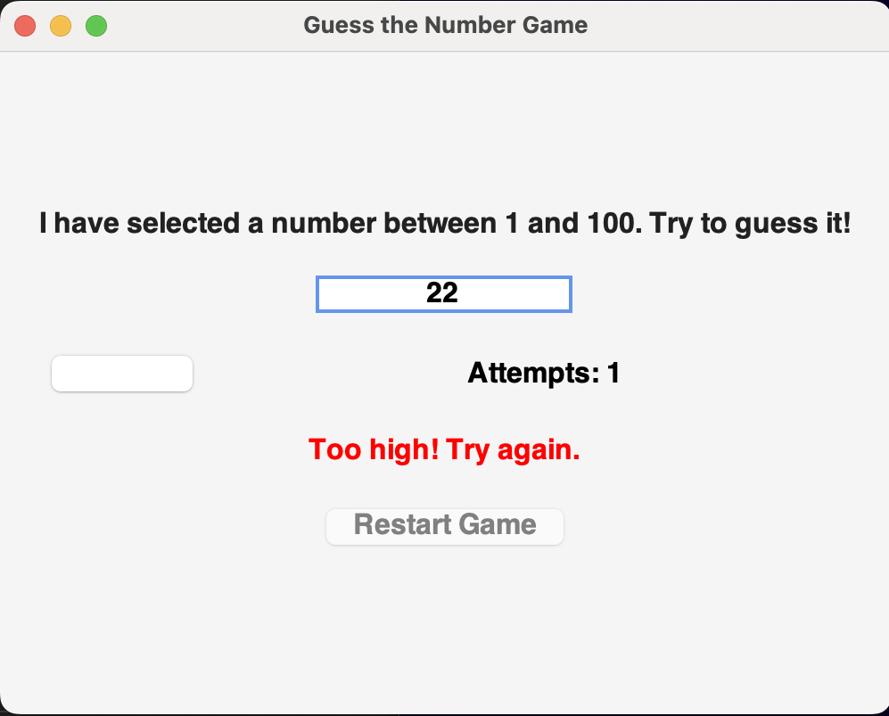
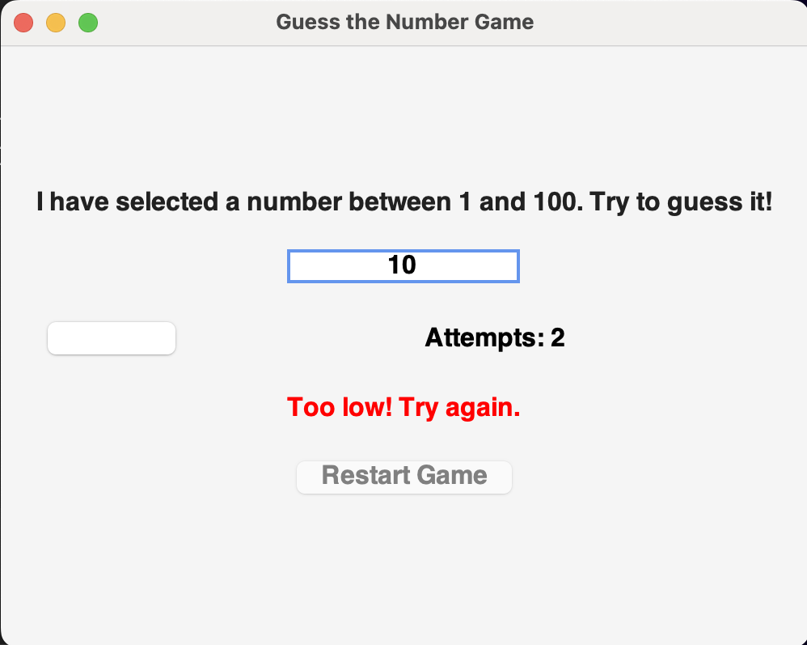
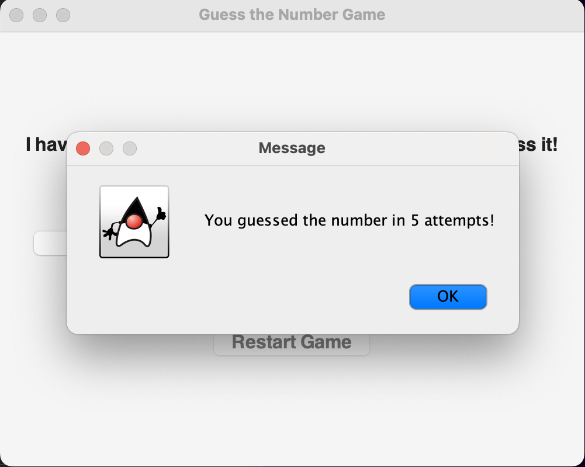
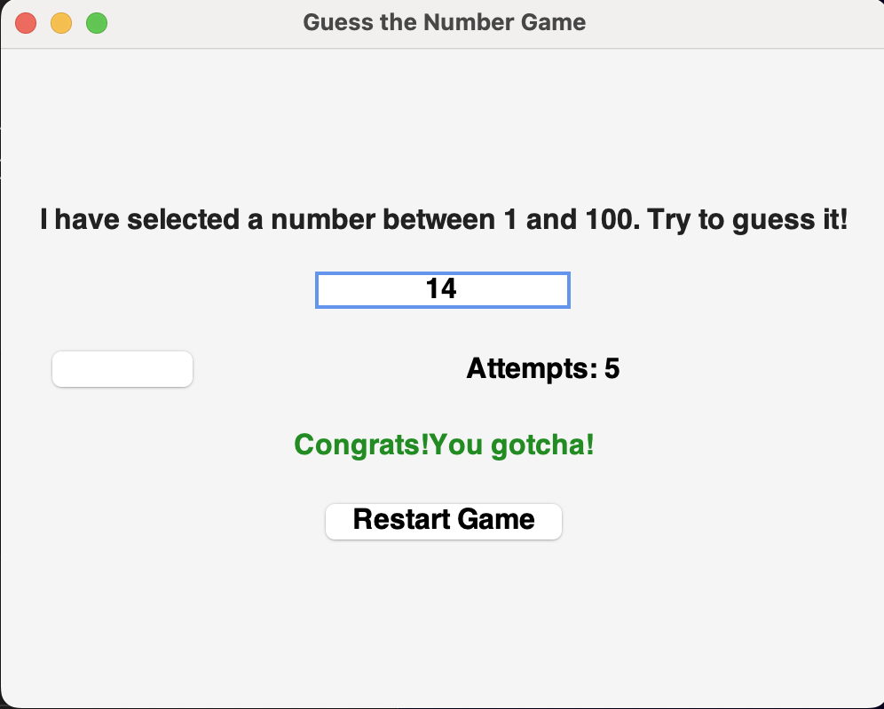

# 🎮 Guess the Number Game - Java GUI

This project was completed as part of my **Java Programming Internship** at **System Tron** (Week 01). The objective of this task was to create a **Java GUI application** that allows users to play a number-guessing game. The game generates a random number between 1 and 100, and the user must guess it, with feedback provided after each guess.

---

## 🚀 Live Demo

This is a Java-based desktop application, so there is no online demo available. You can download and run the code on your local machine to try it out.

---

## 📌 Task Objective

Develop a **GUI-based Java game** that:

* Generates a random number between 1 and 100.
* Takes input from the user and provides feedback (too high, too low, or correct).
* Tracks the number of attempts.
* Allows the user to restart the game after a successful guess.

---

## 🛠️ Technologies Used

* Java

  * Swing (for the GUI)
  * AWT (for basic GUI components)
  * Random (for random number generation)
  * Event Handling (for button click actions)

---

## 📁 Project Structure

```
GuessTheNumberGUI.java        # Main Java program for the number guessing game
README.md                     # Project documentation
```

---

## 🎮 Game Instructions

1. The program generates a random number between 1 and 100.
2. The user inputs a guess in the provided text field and presses the "Guess" button.
3. After each guess:

   * If the guess is too low, the game will prompt the user to try a higher number.
   * If the guess is too high, the game will prompt the user to try a lower number.
   * If the guess is correct, the game will display a success message and enable a restart button.
4. Once the game is over, users can click "Restart Game" to start over with a new random number.

---

## 🖥️ How to Run

1. **Clone the Repository** (if applicable) or download the source code.

2. **Open the Project** in your favorite Java IDE (e.g., IntelliJ IDEA, Eclipse).

3. **Compile and Run** the program.

   If you're running it from the terminal:

   ```bash
   javac GuessTheNumberGUI.java
   java GuessTheNumberGUI
   ```

4. The graphical user interface (GUI) will appear. Enter a guess and click the "Guess" button to start playing!

---

## 🎮 Gameplay Features

* **Input**: Enter your guess (an integer between 1 and 100).
* **Feedback**: The game tells you if your guess is too high or too low.
* **Attempt Tracking**: The game keeps track of how many attempts you've made.
* **Restart**: After a correct guess, you can restart the game with a new random number.

---

## 🖼️ Screenshot

### 01


### 02


### POP Up, After a Correct Guess


### After a Correct Guess


---

## 🔧 Future Scope

* Add difficulty levels (e.g., easy, medium, hard) with different number ranges.
* Implement additional user interface enhancements for better usability.
* Add sound effects or animations to enhance the gaming experience.
* Convert the game into a web application using JavaFX or another framework for web deployment.

---

## 🎓 Internship & Task Details

* **Internship Track**: Java Programming
* **Internship Provider**: System Tron
* **Week**: Week 01
* **Task Name**: Guess the Number Game
* **Environment**: Java with Swing for GUI

---

## 📬 Contact

* **DIFINA GEORGE**
* 📧 difina.georgecs@gmail.com
* 📍 Kerala, India

